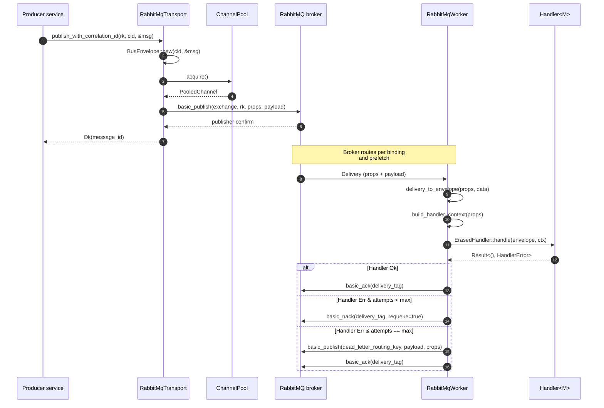
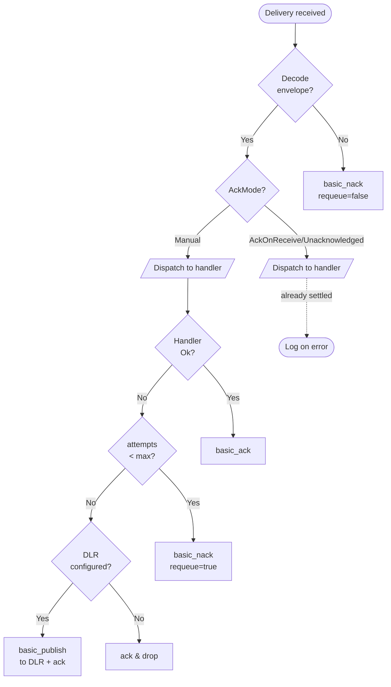

# Bus flow

The bus carries messages between processes through a broker (RabbitMQ in v0.2.0). Producers serialize a typed [`Message`](../concepts/message-envelope.md) into a [`BusEnvelope`](../concepts/message-envelope.md), publish through a [`Transport`](../reference/hexeract-bus.md), and consumers receive deliveries through a [`Worker`](../concepts/worker.md) that dispatches to a typed [`Handler`](../concepts/worker.md).

## Publish then consume

## AckMode decision

A [`RabbitMqWorker`](../concepts/worker.md) reacts to handler failures differently depending on its [`AckMode`](../concepts/ack-modes.md).

## Where each step lives

| Step | Code |
| --- | --- |
| Envelope construction | `BusEnvelope::new` / `with_headers` |
| Channel acquisition | `ChannelPool::acquire` |
| Publish + confirm | `RabbitMqTransport::publish_envelope` |
| Delivery decode | `worker::delivery_to_envelope` |
| Handler context build | `worker::build_handler_context` |
| Dispatch | `ErasedHandler::handle` (via `TypedHandler<M, H>`) |
| Retry accounting | `HashMap<message_id, attempts>` inside `RabbitMqWorker::dispatch` |
| DLR routing | `RabbitMqWorker::handle_manual_outcome` |

For the full retry state machine and the rationale behind keying the counter on `message_id` rather than `delivery_tag`, see the [retry policy](../concepts/retry-policy.md).
