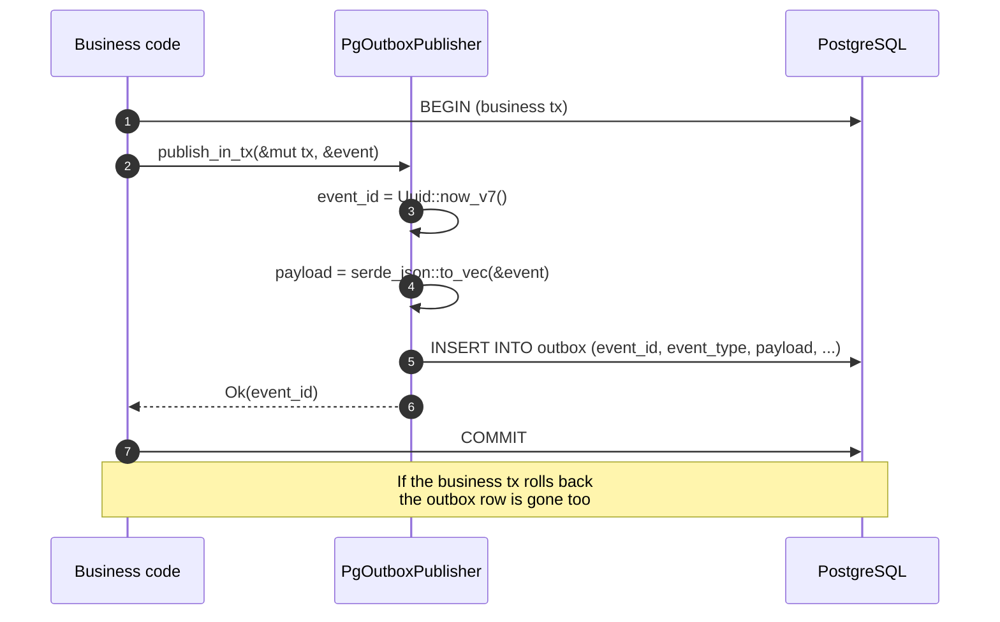
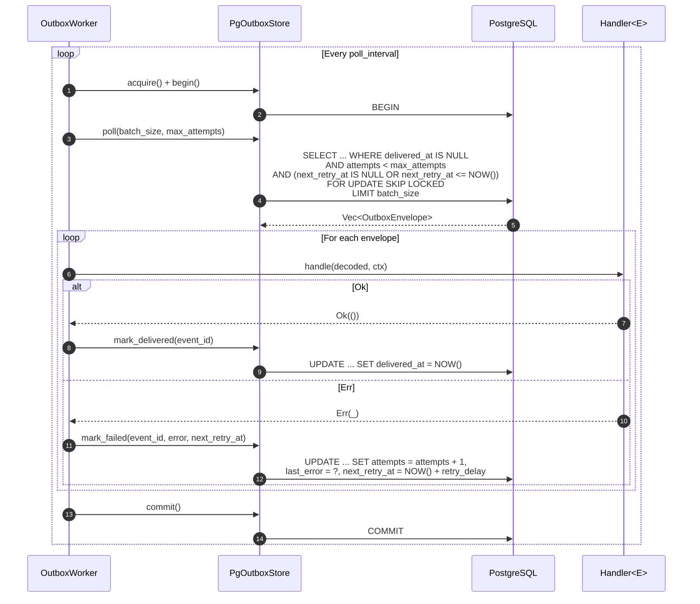

# Outbox flow

This document explains how the Hexeract Outbox is structured, what guarantees it provides and where the trade-offs live. Read [outbox-quick-start.md](../getting-started/outbox-quick-start.md) first if you have not yet wired the outbox into a service.

## Concepts

| Type | Crate | Role |
|---|---|---|
| `Event` | `hexeract-outbox` | Marker trait carried by every domain event flowing through the outbox. Each implementor declares a stable `EVENT_TYPE` string used for routing. |
| `OutboxEnvelope` | `hexeract-outbox` | Row representation of a persisted event. Holds `event_id`, `event_type`, JSON payload, optional `subject_id`, retry bookkeeping (`attempts`, `last_error`, `next_retry_at`) and `delivered_at`. |
| `OutboxError` | `hexeract-outbox` | Unified error type with variants for `Serialization`, `Database`, `MissingHandler`, `MaxRetries`, `TypeMismatch` and `Internal`. |
| `Handler<E>` | `hexeract-outbox` | Asynchronous handler dispatched for each event of type `E`. Returns `Result<(), Self::Error>` where `Self::Error: Into<OutboxError>`. |
| `OutboxPublisher` | `hexeract-outbox` | Backend-agnostic trait for inserting events into the outbox storage. The associated `Tx<'tx>` GAT lets backends expose lifetime-bound transaction handles. |
| `OutboxStore` | `hexeract-outbox` | Backend-agnostic trait for the storage operations the worker needs: `acquire`, `begin`, `poll`, `mark_delivered`, `mark_failed`, `commit`. |
| `ErasedHandler` + `TypedHandler<E, H>` | `hexeract-outbox` | Adapter pair that lifts a typed `Handler<E>` into a dyn-safe handler the worker keys by `event_type` at runtime. |
| `OutboxWorker<S>` | `hexeract-outbox` | Generic worker that polls the store and dispatches envelopes to handlers. `run(cancel)` returns a boxed `Send` future the caller spawns. |
| `PgOutboxPublisher` | `hexeract-outbox-sql` | PostgreSQL implementation of `OutboxPublisher` backed by `sqlx::PgPool`. MySQL and SQLite ship the same surface (`MySqlOutboxPublisher`, `SqliteOutboxPublisher`). |
| `PgOutboxStore` | `hexeract-outbox-sql` | PostgreSQL implementation of `OutboxStore`. |
| `PgOutboxWorkerBuilder` | `hexeract-outbox-sql` | Ergonomic builder that wires a pool, a typed handler registry and tuning knobs into an `OutboxWorker<PgOutboxStore>`. |

## End-to-end flow

### Publish side: enrol the event in the business transaction

### Worker side: poll, dispatch, mark delivered or failed

## Guarantees

| Guarantee | Level |
|---|---|
| Atomic publication | Strict: `publish_in_tx` enrols the insert in the caller's transaction. If the business tx rolls back, the event is gone. |
| Dispatch | At-least-once. Handlers MUST be idempotent. |
| Partial ordering by subject | Events sharing a `subject_id` are polled in `id` order; the partial index `idx_<table>_subject` keeps the lookup cheap. |
| Multi-worker safety | `SELECT ... FOR UPDATE SKIP LOCKED` prevents double dispatch across an arbitrary number of concurrent workers. |
| Retry | Implicit on the next poll; `next_retry_at` enforces a constant `retry_delay` after each failure. Exponential backoff is on the roadmap for v0.5. |
| Backpressure | The worker reads at most `batch_size` rows per poll and sleeps `poll_interval` between empty polls. Sustained throughput scales horizontally by adding workers. |

## Performance

Targets validated on a developer laptop against a local PostgreSQL 16 container:

| Metric | Target | Note |
|---|---|---|
| `publish_in_tx` p99 | < 5 ms | Single `INSERT INTO outbox` inside the caller's transaction. |
| Dispatch p99 (publish → handler call) | < 200 ms | Default `poll_interval = 100 ms`. Lower the interval (e.g. `50 ms`) to halve the upper bound at the cost of CPU. |
| Sustained throughput | 100 events/s with default tuning | Linear with the number of workers. |

The publish latency was measured with a `criterion` benchmark against the PostgreSQL backend; the benchmark retired with the `hexeract-outbox-postgres` crate and has not yet been ported to `hexeract-outbox-sql`.

## Tuning knobs

`OutboxWorkerConfig` exposes:

- `poll_interval` (default `100 ms`): sleep between empty polls.
- `batch_size` (default `10`): rows per poll.
- `max_attempts` (default `5`): excludes a row from polling once it reaches this value. Failed rows past max are observable via SQL, or moved to the dead-letter table when one is configured.
- `retry_base_delay` (default `1 s`) and `retry_max_delay` (default `300 s`): exponential backoff between attempts on a failed row, `min(retry_max_delay, retry_base_delay × 2^n)` with full jitter.

For low-latency workloads, drop `poll_interval` to `20-50 ms` and bump `batch_size` to `25-50`. For high-volume backfills, scale horizontally with more workers, each on its own pool.

Dead-lettering is opt-in: call `dead_letter_table("name")` on the SQL worker builders (PostgreSQL, MySQL, SQLite) to move rows past `max_attempts` into a dedicated table instead of leaving them in the outbox.

## What the outbox does NOT do

- **No cross-DB transaction**. The publisher commits in the caller's DB only. Handlers can talk to a different database (or any other backend) but the cross-system delivery is at-least-once.
- **No scheduled dispatch**. The Scheduler feature lands in v0.6.
- **No polyglot bus brokers**. NATS, Kafka and SQS land in v0.9; RabbitMQ is available today through `hexeract-bus-rabbitmq`.

## Failure modes

- **Database unreachable during `publish_in_tx`**: the call returns `OutboxError::Database`, the business transaction can be rolled back as usual.
- **Database unreachable during a poll cycle**: the worker logs an `error` and sleeps `poll_interval` before retrying. The loop never exits on transient store errors.
- **Handler panics**: `tokio::spawn` carries the panic to the join handle of the worker; in practice you should wrap your handler logic in `Result::Err` mapping rather than panicking. Future versions may catch handler panics as failures rather than aborting the worker.
- **Worker crashes mid-cycle**: any envelope locked by the crashed worker is released by PostgreSQL automatically (the transaction was never committed). Another worker picks them up on the next poll.
