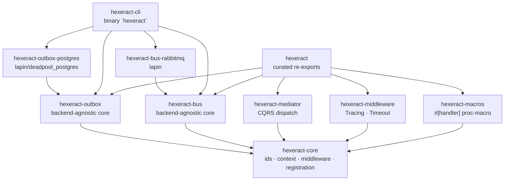

# Workspace overview

Hexeract ships as a Cargo workspace. Each feature lives in its own crate so applications can pull exactly what they need without dragging brokers, databases or proc-macros they will not use.

## Crate dependency graph



## Crate roles

| Crate | Role | Status |
| --- | --- | --- |
| `hexeract-core` | Cross-cutting primitives: `MessageId`, `CorrelationId`, `HandlerContext`, middleware traits. | Stable |
| `hexeract-outbox` | Outbox pattern building blocks: `Event`, `OutboxEnvelope`, `OutboxPublisher`, `OutboxStore`, `OutboxWorker`. | Stable |
| `hexeract-outbox-postgres` | PostgreSQL backend powered by `deadpool_postgres`, BYO-schema strategy. | Stable |
| `hexeract-bus` | Bus pattern building blocks: `Message`, `BusEnvelope`, `Transport`, `Handler`, topology types. | Stable |
| `hexeract-bus-rabbitmq` | RabbitMQ backend powered by `lapin`. `RabbitMqTransport`, `RabbitMqWorker`, topology helpers. | Stable |
| `hexeract-cli` | Binary `hexeract`. Subcommands `outbox patch/apply/check` and `bus declare/peek/purge`. | Stable |
| `hexeract-mediator` | In-process CQRS dispatch: `MediatorBuilder`, `Mediator::send/query/publish`, fan-out fail-safe semantics. | Stable |
| `hexeract-middleware` | Built-in middlewares: `TracingMiddleware` (span + structured events), `TimeoutMiddleware` (`tokio::time::timeout`). | Stable |
| `hexeract-macros` | `#[handler]` attribute proc-macro: generates trait impls and submits to `inventory` for `verify_handlers`. | Stable |
| `hexeract` | Curated facade re-exporting the stable surface. | Stable |

## Layering principles

1. **Each feature has a backend-agnostic core crate** (`hexeract-bus`, `hexeract-outbox`). Backends live in companion crates (`hexeract-bus-rabbitmq`, `hexeract-outbox-postgres`) so MSRV and dependency churn stay scoped.
2. **No backend crate depends on another backend crate.** A project that only needs the outbox never compiles `lapin`; a project that only needs the bus never compiles `tokio-postgres`.
3. **Symmetry between features.** `OutboxWorker` and `RabbitMqWorker` expose mirrored fluent builders, `OutboxPublisher` and `Transport` mirror their publish APIs. Once you know one, the other reads itself.
4. **The CLI is a thin operator-facing wrapper.** Every CLI subcommand maps one-to-one to a library API. Anything the CLI can do can also be done from code.

## Where features live in the source

```text
crates/
├── hexeract-core/
│   └── src/{ids,context,command,query,envelope,middleware}.rs
├── hexeract-bus/
│   └── src/{envelope,error,handler,message,topology,transport}.rs
├── hexeract-bus-rabbitmq/
│   ├── src/{connection,pool,topology,transport,worker}.rs
│   ├── tests/integration.rs
│   └── examples/03_bus_pubsub.rs
├── hexeract-outbox/
│   └── src/{envelope,error,event,handler,publisher,worker}.rs
├── hexeract-outbox-postgres/
│   └── src/{builder,publisher,schema,store}.rs
└── hexeract-cli/
    └── src/{cli,commands/{outbox,bus}}.rs
```
