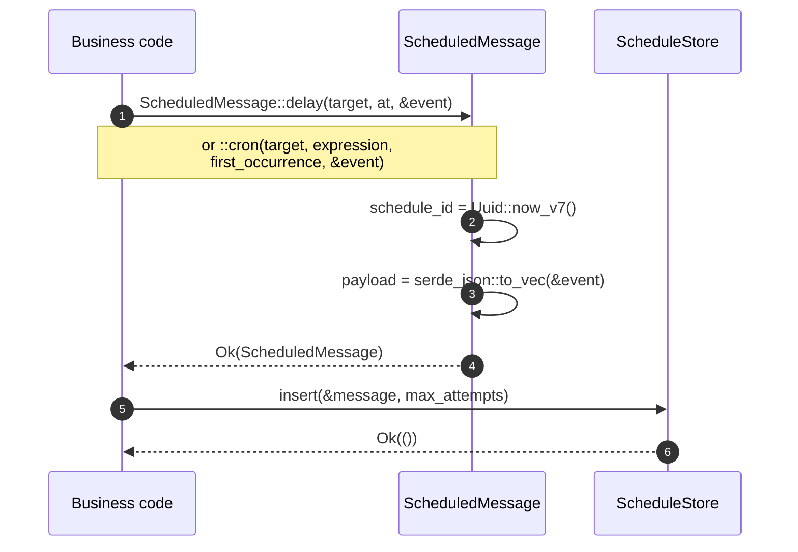
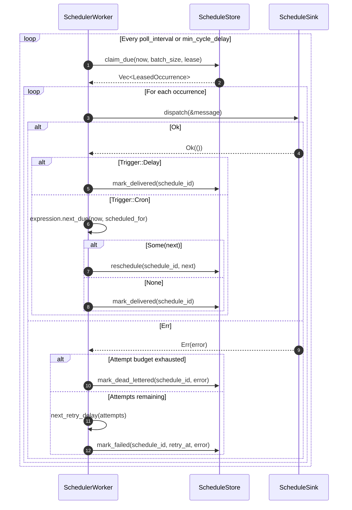

# Scheduler flow

This document explains how the Hexeract Scheduler is structured and how a schedule flows from persistence to dispatch. Read [scheduler-quick-start.md](../getting-started/scheduler-quick-start.md) first if you have not yet wired the scheduler into a service.

## Concepts

| Type | Crate | Role |
|---|---|---|
| `ScheduledMessage` | `hexeract-scheduler` | Persisted unit of future work: a serialized event, its dispatch `Target`, its `Trigger` (delay or cron) and the UTC instant of the current occurrence (`scheduled_for`). Built with `::delay` or `::cron`. |
| `Trigger` | `hexeract-scheduler` | `Delay(SystemTime)` fires once; `Cron(CronExpression)` recurs and exposes `next_due` to compute the following occurrence. |
| `Target` | `hexeract-scheduler` | Dispatch destination: `mediator()`, `outbox()` or `bus(routing_key)`. |
| `ScheduleStore` | `hexeract-scheduler` | Backend-agnostic contract for persisting and claiming schedules: `insert`, `claim_due`, `mark_delivered`, `reschedule`, `mark_failed`, `mark_dead_lettered`, `cancel`, `set_paused`, `inspect`, `resume`. |
| `LeasedOccurrence` | `hexeract-scheduler` | An occurrence returned by `claim_due`, carrying the `ScheduledMessage`, its attempt count and its lease deadline. |
| `ScheduleSink` | `hexeract-scheduler` | Contract for dispatching a due occurrence to its destination. `BusSink`, `OutboxSink` and `MediatorSink` each implement it for one `Target`. |
| `SchedulerWorker` | `hexeract-scheduler` | Polling worker that claims due occurrences from a `ScheduleStore`, dispatches them through a `ScheduleSink`, and settles each one (reschedule, deliver, retry or dead-letter). `run(cancel)` drives the loop until cancelled. |
| `SchedulerControl` | `hexeract-scheduler` | Operator-facing wrapper over a store: `inspect`, `pause`, `resume`, `cancel` a schedule outside the worker's hot path. |

## End-to-end flow

### Schedule side: persist a delayed or recurring message

### Worker side: poll, claim, dispatch, settle

`ScheduleSink` has three implementations selected by the message's `Target`: `BusSink` publishes onto the message bus, `OutboxSink` enqueues idempotently into the transactional outbox, and `MediatorSink` republishes in-process through the mediator. All three tolerate redelivery under the at-least-once claim contract; consumers deduplicate on `ScheduledMessage::occurrence_id()`.

Outside this hot path, `SchedulerControl` lets an operator `inspect`, `pause`, `resume` or `cancel` a schedule without touching the worker loop.

## Where to read next

- [Scheduler triggers](../concepts/scheduler-triggers.md)
- [Scheduler delivery](../concepts/scheduler-delivery.md)
- [hexeract-scheduler API reference](../reference/hexeract-scheduler.md)
