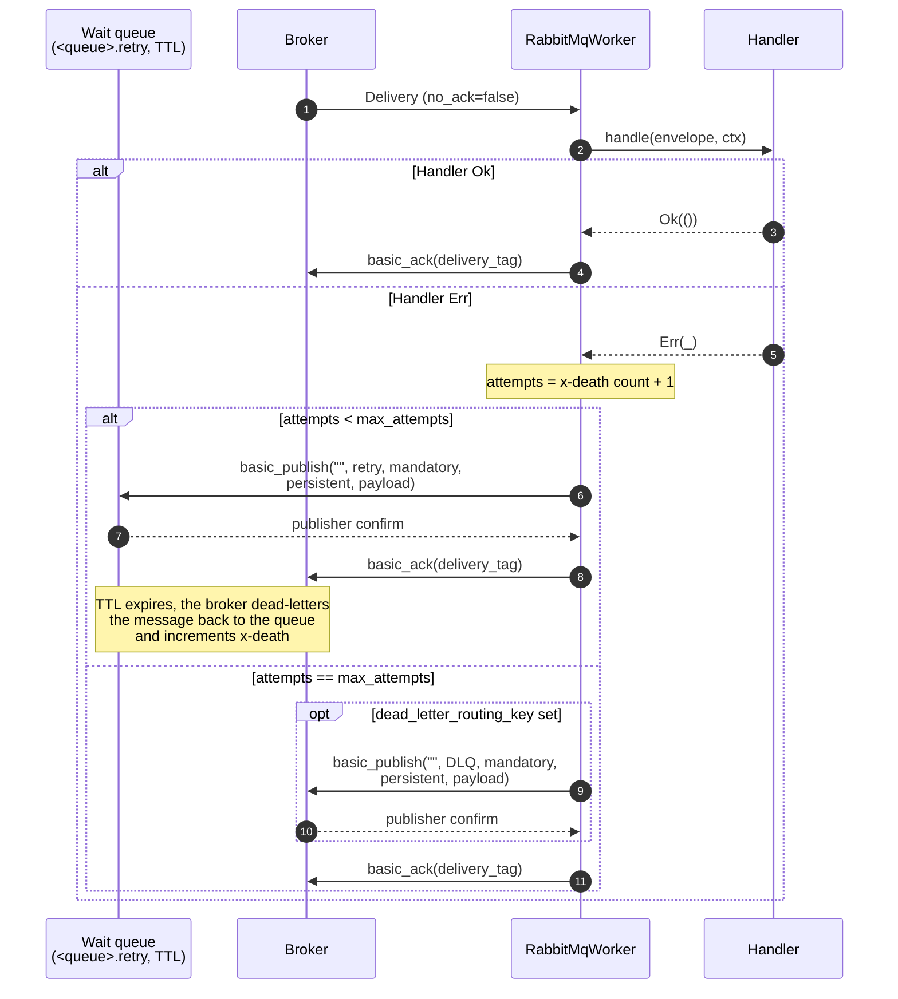
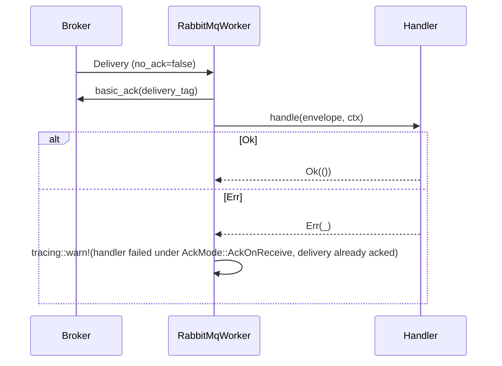
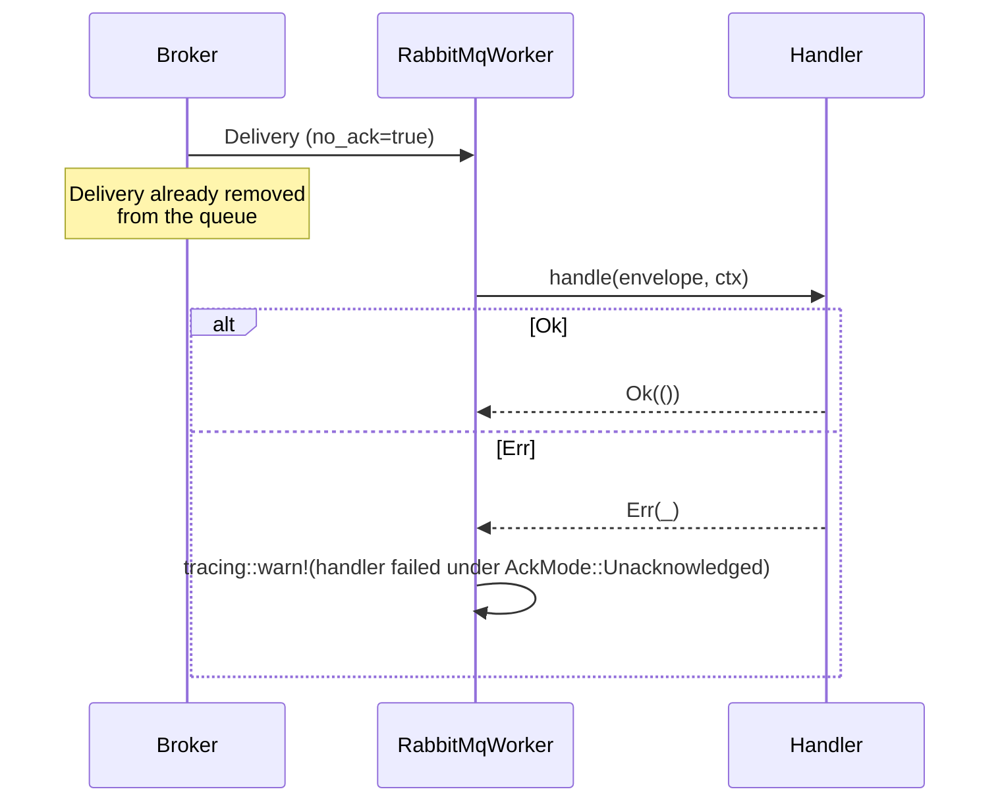

# Ack modes

The `RabbitMqWorker` reacts to handler outcomes differently depending on the [`AckMode`](../reference/hexeract-bus-rabbitmq.md) configured on the builder. Three values are shipped:

| Variant | Consumer flag | Ack timing | Handler failure | Guarantee |
| --- | --- | --- | --- | --- |
| `AckMode::Manual` (default) | `no_ack = false` | After handler `Ok` | Republished to the wait queue, redelivered after `retry_delay`, up to `max_attempts`, then DLR or drop | At-least-once |
| `AckMode::AckOnReceive` | `no_ack = false` | On receive, before handler | Logged via `tracing::warn`, never retried | At-most-once |
| `AckMode::Unacknowledged` | `no_ack = true` | None (broker removes on send) | Logged via `tracing::warn`, never retried | Fire-and-forget (lossy) |

## Manual: ack on success, delayed retry on failure

In `AckMode::Manual`, the broker keeps the delivery until the worker settles it. On handler failure the worker republishes the delivery to a durable wait queue (`<queue>.retry`, declared by the worker at startup) through a mandatory, confirmed and persistent publish, then acks the original only once that publisher confirm proves the copy is durably stored. Publisher confirms are enabled for every `Manual` worker (not only when a dead-letter routing key is set), so the original is never acked ahead of the retry copy. The wait queue carries a per-queue TTL equal to `retry_delay` and a dead-letter route back to the consumed queue, so the broker redelivers the message after the delay and increments the `x-death` header that the worker reads as the attempt count.

The attempt count travels with the message in the broker-maintained `x-death` header instead of living in process memory, so it survives worker restarts and is shared by every consumer of the queue. Exhausted deliveries go to a durable dead-letter queue declared by the worker at startup, through a mandatory, confirmed and persistent publish. When that publish fails on a live channel the worker nacks the original to free its prefetch slot rather than leaving it unsettled (which would stall the consumer): a transient failure requeues for another attempt, an unroutable dead-letter queue drops the delivery. See the [retry policy](retry-policy.md) for the full state machine and operational caveats.

Deliveries that fail to decode into an envelope (a payload larger than `max_payload_bytes`, a missing AMQP `type` property) never reach a handler and skip the retry budget entirely. With a dead-letter queue configured they are parked immediately through the same hardened publish, whatever the ack mode (best-effort under `Unacknowledged`, which cannot settle). Without one, `Manual` nacks them without requeue so a broker-level dead-letter exchange still applies, and the other modes drop them with a warning.

## AckOnReceive: explicit at-most-once

In `AckMode::AckOnReceive`, the worker sends `basic_ack` as soon as it receives and decodes a delivery, before running the handler. `no_ack` is not set, so the broker still applies prefetch (`basic.qos`) and the ack is a real protocol acknowledgement. A handler failure is logged and never retried.

Prefer `AckOnReceive` over `Unacknowledged` when you want at-most-once but still benefit from prefetch back-pressure and explicit acks. A crash after the ack and before the handler completes still drops that in-flight delivery.

## Unacknowledged: fire-and-forget

In `AckMode::Unacknowledged`, the consumer is opened with `no_ack = true`. The broker considers a delivery acknowledged the moment it leaves the queue and never expects an ack or nack. This is the highest-throughput mode, but any handler failure or crash loses the message, and prefetch does not apply.

Use `Unacknowledged` only when loss is acceptable and throughput is paramount, for example metrics or fan-out to non-critical sinks, and the producer side already enforces durability through another mechanism (an outbox, a replayable log, ...).

## Choosing a mode

| Question | Pick |
| --- | --- |
| Can the handler crash mid-side-effect and leave a half-written state? | `Manual` |
| Is at-least-once required (every message dispatched at least once)? | `Manual` |
| Do you want at-most-once but with prefetch back-pressure and explicit acks? | `AckOnReceive` |
| Is the producer durable already and the consumer a pure projection where loss is fine? | `AckOnReceive` or `Unacknowledged` |
| Is raw throughput the only thing that matters and loss acceptable? | `Unacknowledged` |
| Are downstream calls idempotent? | Any mode is safe |

When in doubt, start with `Manual` and move to a lossy mode only if you can argue the producer side compensates for losses.
