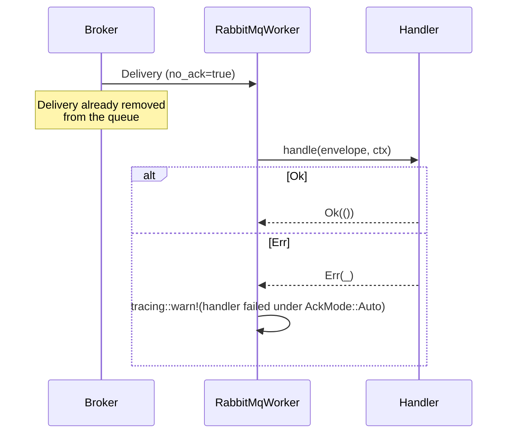
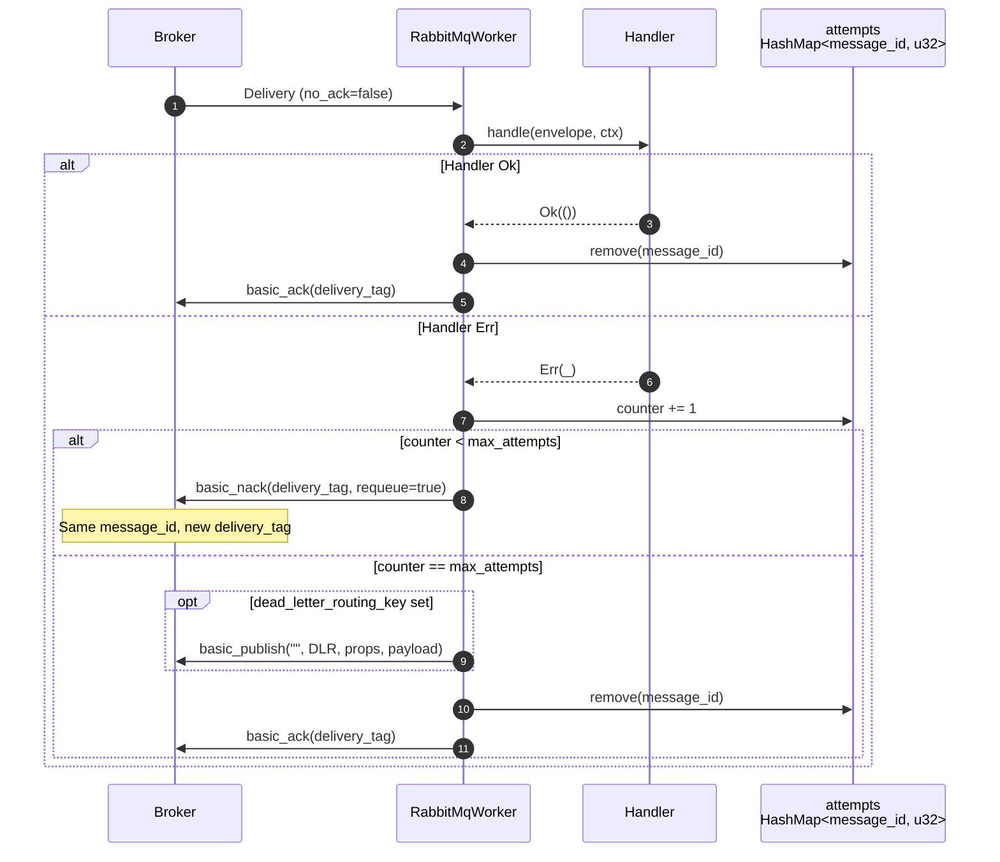

# Ack modes

The `RabbitMqWorker` reacts to handler outcomes differently depending on the [`AckMode`](../reference/hexeract-bus-rabbitmq.md) configured on the builder. Two values are shipped in v0.2.0:

| Variant | Consumer flag | Handler failure | When to use |
| --- | --- | --- | --- |
| `AckMode::Auto` | `no_ack = true` | Logged via `tracing::warn`, never retried | Best-effort projections, metrics, fan-out to non-critical sinks |
| `AckMode::Manual` (default) | `no_ack = false` | `basic_nack(requeue=true)` up to `max_attempts`, then DLR or drop | Anything you cannot afford to drop silently |

## Auto: fire-and-forget

In `AckMode::Auto`, the broker considers a delivery acknowledged the moment it leaves the queue. The worker decodes and dispatches as usual, but it never sends an `ack` or `nack`. If the handler returns `Err`, the failure is logged and the delivery is gone.

Use `Auto` only when:

- The handler is idempotent and the worst case (a missed delivery) is acceptable.
- The producer side already enforces durability through a different mechanism (an outbox, a replayable Kafka topic, ...).

## Manual: ack on success, nack on failure

In `AckMode::Manual`, the broker keeps the delivery until the worker sends an explicit `basic_ack` or `basic_nack`. The worker keeps an in-memory `HashMap<message_id, attempts>` to track redeliveries.

The counter is keyed on the AMQP `message_id` so it survives across redeliveries (which mint a fresh `delivery_tag` each time the broker hands the message back). See the [retry policy](retry-policy.md) for the full state machine and the volatility caveat across consumer restarts.

## Choosing between Auto and Manual

| Question | Pick |
| --- | --- |
| Can the handler crash mid-side-effect and leave a half-written state? | `Manual` |
| Is at-least-once semantics required (every message dispatched at least once)? | `Manual` |
| Is the producer durable already (outbox, log) and the consumer purely a projection? | `Auto` is acceptable |
| Are downstream calls idempotent? | Both modes are safe |

When in doubt, start with `Manual` and downgrade to `Auto` only if you can argue the producer side compensates for losses.
