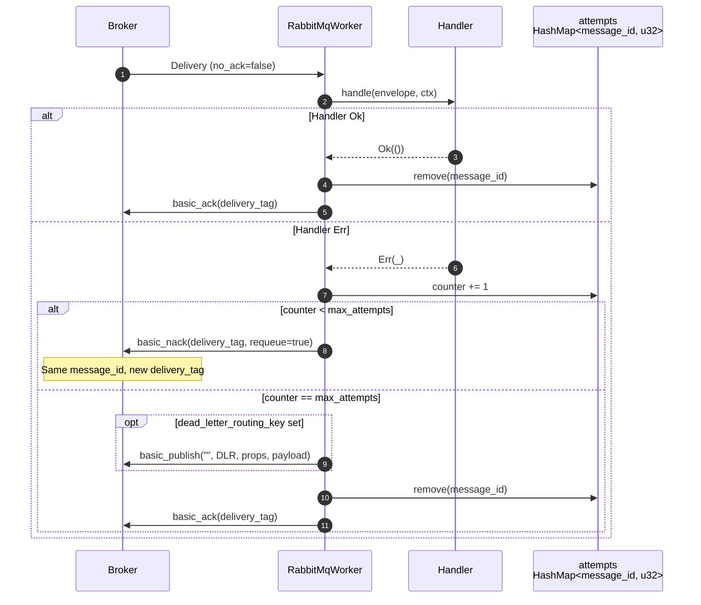
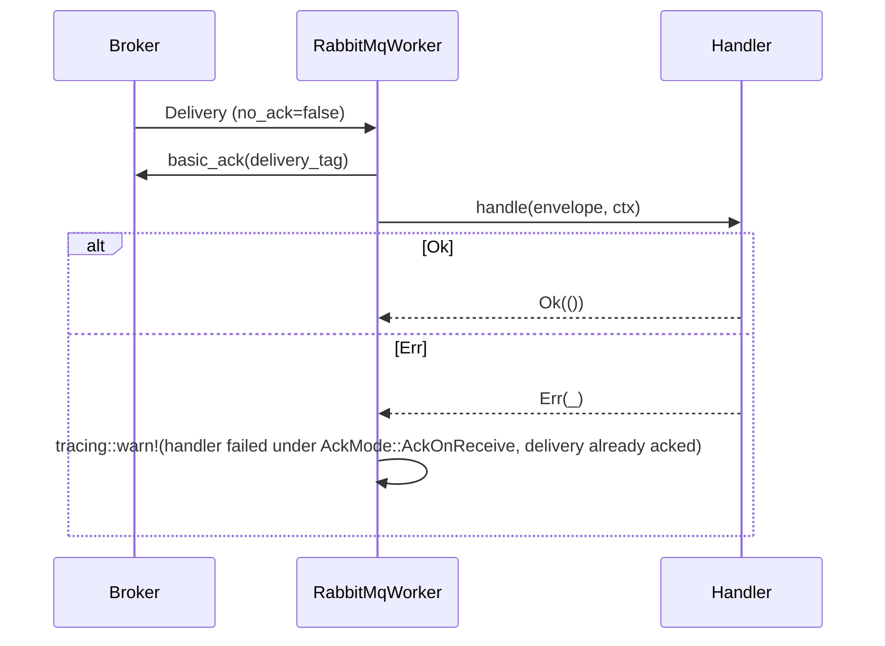
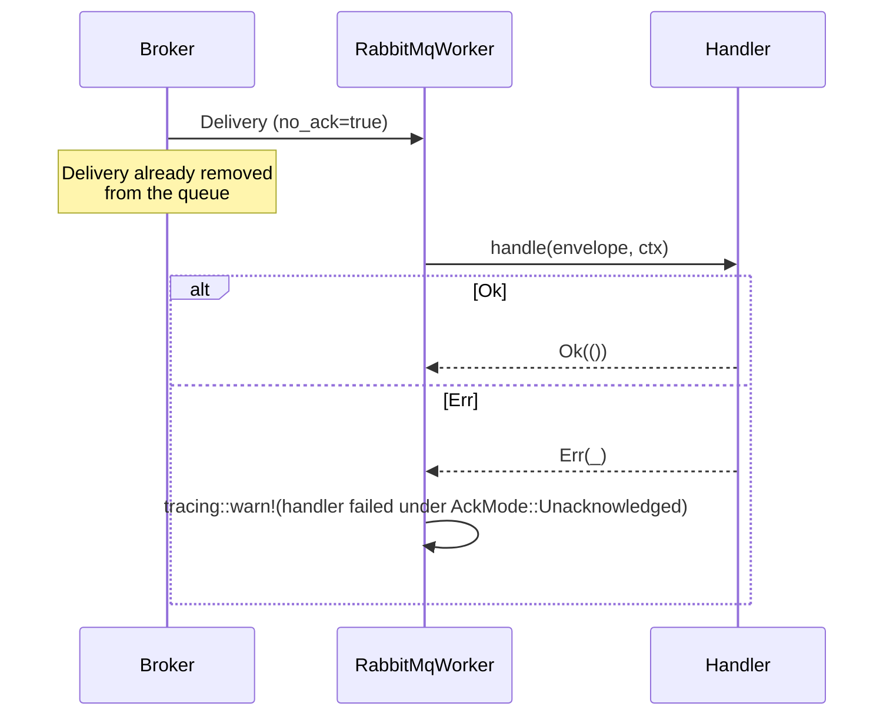

# Ack modes

The `RabbitMqWorker` reacts to handler outcomes differently depending on the [`AckMode`](../reference/hexeract-bus-rabbitmq.md) configured on the builder. Three values are shipped:

| Variant | Consumer flag | Ack timing | Handler failure | Guarantee |
| --- | --- | --- | --- | --- |
| `AckMode::Manual` (default) | `no_ack = false` | After handler `Ok` | `basic_nack(requeue=true)` up to `max_attempts`, then DLR or drop | At-least-once |
| `AckMode::AckOnReceive` | `no_ack = false` | On receive, before handler | Logged via `tracing::warn`, never retried | At-most-once |
| `AckMode::Unacknowledged` | `no_ack = true` | None (broker removes on send) | Logged via `tracing::warn`, never retried | Fire-and-forget (lossy) |

## Manual: ack on success, nack on failure

In `AckMode::Manual`, the broker keeps the delivery until the worker sends an explicit `basic_ack` or `basic_nack`. The worker keeps an in-memory `HashMap<message_id, attempts>` to track redeliveries.

The counter is keyed on the AMQP `message_id` so it survives across redeliveries (which mint a fresh `delivery_tag` each time the broker hands the message back). See the [retry policy](retry-policy.md) for the full state machine and the volatility caveat across consumer restarts.

## AckOnReceive: explicit at-most-once

In `AckMode::AckOnReceive`, the worker sends `basic_ack` as soon as it receives and decodes a delivery, before running the handler. `no_ack` is not set, so the broker still applies prefetch (`basic.qos`) and the ack is a real protocol acknowledgement. A handler failure is logged and never retried.

Prefer `AckOnReceive` over `Unacknowledged` when you want at-most-once but still benefit from prefetch back-pressure and explicit acks. A crash after the ack and before the handler completes still drops that in-flight delivery.

## Unacknowledged: fire-and-forget

In `AckMode::Unacknowledged`, the consumer is opened with `no_ack = true`. The broker considers a delivery acknowledged the moment it leaves the queue and never expects an ack or nack. This is the highest-throughput mode, but any handler failure or crash loses the message, and prefetch does not apply.

Use `Unacknowledged` only when loss is acceptable and throughput is paramount, for example metrics or fan-out to non-critical sinks, and the producer side already enforces durability through another mechanism (an outbox, a replayable log, ...).

## Choosing a mode

| Question | Pick |
| --- | --- |
| Can the handler crash mid-side-effect and leave a half-written state? | `Manual` |
| Is at-least-once required (every message dispatched at least once)? | `Manual` |
| Do you want at-most-once but with prefetch back-pressure and explicit acks? | `AckOnReceive` |
| Is the producer durable already and the consumer a pure projection where loss is fine? | `AckOnReceive` or `Unacknowledged` |
| Is raw throughput the only thing that matters and loss acceptable? | `Unacknowledged` |
| Are downstream calls idempotent? | Any mode is safe |

When in doubt, start with `Manual` and move to a lossy mode only if you can argue the producer side compensates for losses.
