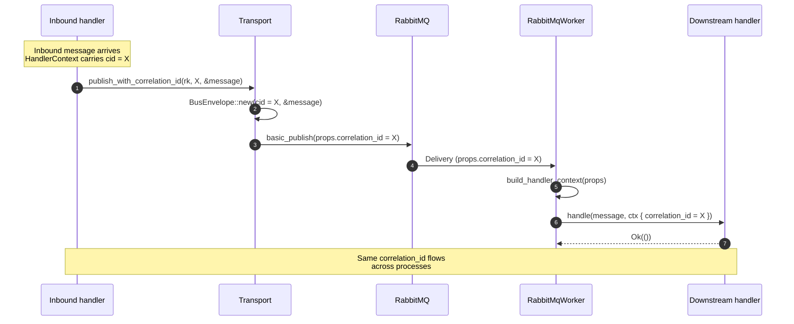

# Correlation ID propagation

Hexeract distinguishes the `message_id` (unique per outgoing message) from the `correlation_id` (shared by every message belonging to the same causal chain). The bus carries the `correlation_id` as a first-class AMQP property and exposes it on both sides of the wire.

## End-to-end propagation



## API surface

The `Transport` trait exposes three publish methods. Each tells the broker something different about how the `correlation_id` is sourced:

| Method | `correlation_id` source |
| --- | --- |
| `publish(routing_key, &M)` | Minted by the transport (`Uuid::now_v7()`). Use for the root message of a new chain. |
| `publish_with_headers(routing_key, headers, &M)` | Minted by the transport. Use when the caller needs to attach W3C trace headers or tenancy alongside. |
| `publish_with_correlation_id(routing_key, correlation_id, &M)` | Supplied by the caller. Use to continue an existing causal chain. |

On the consumer side, every `Handler<M>::handle` receives a `HandlerContext` whose `correlation_id` field reflects the `BasicProperties.correlation_id` of the inbound AMQP delivery (or a fresh UUIDv7 if the property is absent).

```rust
impl Handler<OrderPlaced> for Projector {
    type Error = BusError;

    async fn handle(&self, msg: OrderPlaced, ctx: &HandlerContext) -> Result<(), Self::Error> {
        // Forward to a downstream service while keeping the same chain.
        self.downstream
            .publish_with_correlation_id("audit.events", ctx.correlation_id.as_uuid(), &msg)
            .await?;
        Ok(())
    }
}
```

## Distinction between `message_id` and `correlation_id`

| Field | Lifetime | Cardinality | Mint policy |
| --- | --- | --- | --- |
| `message_id` | One per outgoing message | Strict 1-to-1 with a publish call | Always minted server-side (UUIDv7) by the transport |
| `correlation_id` | One per causal chain | 1-to-many: the same `correlation_id` spans every publish in the chain | Caller-supplied when continuing a chain, else minted by the transport |

A `correlation_id` is a means to ask "which inbound request triggered this work?" across an arbitrary number of hops. The `message_id` answers "which specific publish are we talking about?".

## Where the value travels

The `correlation_id` rides through the AMQP property of the same name. The bus serialises it as a UUID string (`xxxxxxxx-xxxx-xxxx-xxxx-xxxxxxxxxxxx`) and consumers parse it back through `Uuid::parse_str`. If the parse fails (a non-UUID `correlation_id` produced by another framework), the worker falls back to a fresh UUIDv7 so the chain is broken but the handler still runs.

## Tracing integration (v0.10.0)

Full OpenTelemetry span coverage lands in v0.10.0. Until then, the recommended setup is:

1. Carry your W3C `traceparent` in the `headers` map (alongside the `correlation_id` AMQP property).
2. On the consumer side, read the header in your handler and attach it to the local span context.
3. When re-emitting downstream, use `publish_with_headers` to forward the trace header verbatim, and `publish_with_correlation_id` to forward the causal chain identifier.
