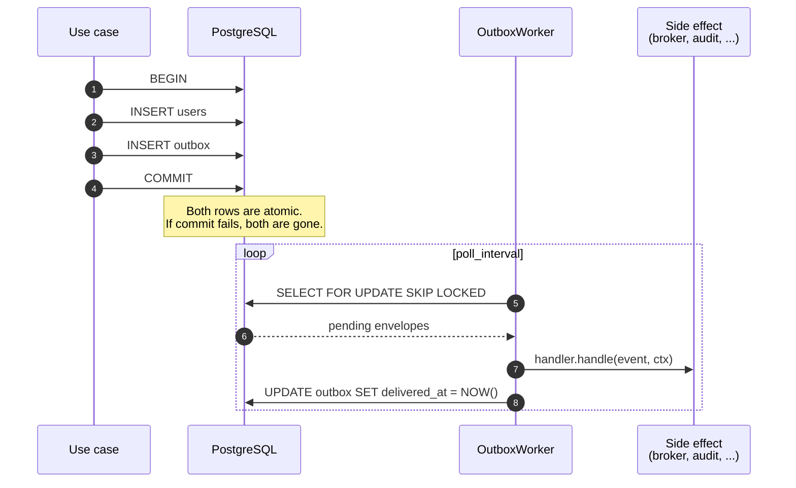

# Outbox pattern

The transactional outbox solves a single, deceptively hard problem: **write a business state mutation and emit the matching domain event atomically, without distributed transactions.**

## The problem

Imagine a service that handles a `RegisterUser` command:

1. INSERT the user row in PostgreSQL.
2. PUBLISH a `users.registered` event to RabbitMQ.

If step 1 commits and the service crashes before step 2, the broker never sees the event and the rest of the system never learns the user exists. If step 2 succeeds and step 1 then rolls back, downstream services act on a user that does not exist.

Two-phase commit across PostgreSQL and RabbitMQ is theoretically possible, in practice unworkable.

## The outbox solution

Persist the event in the same database, in the same transaction, in an `outbox` table. A background worker then polls the table and dispatches each row to its handler. Because the row writes are atomic with the business state, the event is either definitely persisted or definitely not.

## Guarantees

| Property | Outbox guarantee |
| --- | --- |
| **Atomicity** with business state | Strict. The outbox row is inserted in the caller's transaction. |
| **Delivery** | At-least-once. Handlers must be idempotent. |
| **Ordering per aggregate** | Optional, via `subject_id`. Events sharing a `subject_id` are polled in `event_id` order. |
| **Multi-worker safety** | `SELECT ... FOR UPDATE SKIP LOCKED` lets an arbitrary number of workers consume the same outbox without double-dispatching. |
| **Crash recovery** | PostgreSQL and MySQL release the row lock automatically on worker crash (`SELECT ... FOR UPDATE SKIP LOCKED`); the next poll picks the envelope up. SQLite uses a soft lease that expires after its configured duration before another worker can reclaim the row. |

## What an outbox is NOT

- **Not a message broker.** The outbox is a durable buffer between your business transaction and whatever side effect needs to happen. The handler is typically the bridge that actually publishes to RabbitMQ, Kafka, etc.
- **Not a workflow engine.** The outbox dispatches one event to one handler. Sagas, orchestration and compensation live in v0.8.0 (Sagas milestone).
- **Not synchronous.** Dispatch latency is bounded by `poll_interval`, default `100 ms`. For latency-critical paths, drop the interval or scale workers horizontally.

## When to reach for the outbox

| Situation | Outbox? |
| --- | --- |
| You write business state to a database and want to emit an event derived from that state | Yes |
| The event must reach a broker or another database reliably | Yes |
| You have multiple downstream consumers that each need the event | Yes (one handler can be the bridge to the broker; multiple consumers then read from the broker) |
| You only need fire-and-forget projections inside the same process | No, use a mediator handler (v0.3.0) directly |
| You need synchronous request-reply | No, use the Request/Reply feature (v0.7.0) |

## Implementation pieces

The [`hexeract-outbox`](../reference/hexeract-outbox.md) crate ships the backend-agnostic plumbing:

- [`Event`](message-envelope.md) marker trait and `OutboxEnvelope` row representation.
- [`OutboxPublisher`](../reference/hexeract-outbox.md) trait with `publish_in_tx(&mut tx, &event)`. Each backend implements its own `Tx<'tx>`.
- [`OutboxStore`](../reference/hexeract-outbox.md) trait that the worker drives (`acquire`, `begin`, `poll`, `mark_delivered`, `mark_failed`, `commit`, `claim`, `mark_dead_lettered`).
- [`OutboxWorker`](worker.md) generic over a store, with a `CancellationToken`-aware poll loop.

The [`hexeract-outbox-sql`](../reference/hexeract-outbox-sql.md) crate provides SQL backends for PostgreSQL, MySQL and SQLite. For each backend it exposes a canonical schema strategy: `Dialect::schema_ddl(table)` returns the DDL string to feed into your migration tooling, and `ensure_schema(&pool, table)` is an idempotent dev/test helper. The fluent builder (`PgOutboxWorkerBuilder`, `MySqlOutboxWorkerBuilder`, `SqliteOutboxWorkerBuilder`) wires store, handlers and worker together. The legacy [`hexeract-outbox-sql`](../reference/hexeract-outbox-sql.md) crate supersedes `hexeract-outbox-postgres`, which was deprecated since 0.4.0 and removed in 0.5.0.

For a deeper dive into the SQL and the row lifecycle, see the [outbox flow architecture](../architecture/outbox-flow.md).
