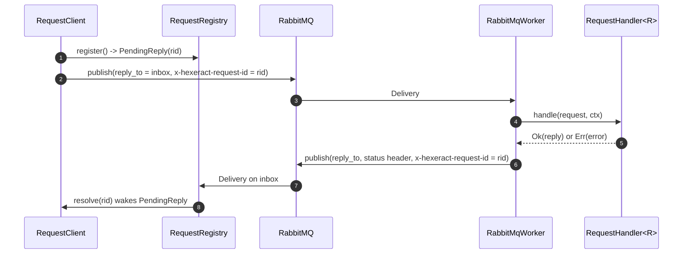

# Request-reply

Hexeract's request-reply pattern layers a synchronous-over-async RPC call on top of the fire-and-forget bus: a caller publishes a typed request and awaits a typed reply, correlated back to it by a freshly minted identifier. This page covers the correlation registry and its drop-guard, the wire contract two independent processes agree on for a reply envelope, the four ways a request can fail, and the lifecycle of the exclusive reply inbox.

## The pattern

A `Request` is a `Message` that names its own reply type via the associated `Reply: Message`. `RequestClient::request` (or `RequestClient::request_with_timeout` for an explicit deadline) publishes the request envelope with a fresh correlation id and a `reply_to` inbox name, then awaits the matching reply. On the responder side, `RequestHandler<R>` is the typed counterpart to `Handler<M>` (see [Message and envelope](message-envelope.md)): instead of producing a side effect, it returns `R::Reply`. `RepliedHandler` adapts a `RequestHandler<R>` into an `ErasedHandler` a worker can dispatch: it decodes the request, runs the handler, and publishes the typed reply (or an encoded error) back to the caller's `reply_to`, preserving the inbound correlation id. `RabbitMqWorkerBuilder::register_request_handler` wires a `RequestHandler<R>` into a worker exactly the way `register_handler` wires a plain `Handler<M>`.

## Request registry and the drop-guard

`RequestRegistry` is the rendezvous point between a waiting caller and an inbound reply. `register()` mints a fresh request id, opens a `tokio::sync::oneshot` channel, and returns a `PendingReply`: an RAII guard over that channel. The inbox consumer calls `resolve(envelope)` to route a delivered reply to its waiting slot by request identity, read from the reserved `x-hexeract-request-id` header; an unknown or already-resolved id is dropped with a warning, never an error, and the first reply for a slot wins.

The drop-guard is what makes the registry leak-free. `PendingReply`'s `Drop` implementation removes its slot from the registry on every exit path, whatever gets the caller out: a successful `wait()`, a timeout racing the `wait()` future, a cancellation, or a panic unwinding through the caller. A slot is never left behind for a reply that never arrives, and `RequestRegistry::drain()` (used on connection loss) closes every outstanding channel at once so every waiting caller observes a closed channel immediately instead of waiting out its timeout.

## Wire contract

Requester and responder agree on the reply shape purely through envelope conventions, with no shared connection state:

- The request envelope carries `reply_to` (the inbox queue name), the header `x-hexeract-request-id` (the fresh request identity the caller registered, used to route the reply) and `correlation_id` (the causal-chain identifier, unrelated to routing).
- The reply envelope stamps the header `x-hexeract-reply-status` to either `ok` or `error`, and carries the same `correlation_id` as the request.
- On success, the reply payload decodes as `R::Reply` like any other message.
- On failure, the reply's `message_type` is stamped with the sentinel `hexeract.reply.error` and the payload decodes as `RemoteErrorPayload`, a protocol type deliberately not a `Message`: a remote fault is not a domain message. `RemoteErrorPayload` carries `error_type` (a stable-ish category, the name of the `BusError` variant the responder's error converted into) and `message` (the human-readable failure text).

A request published without a `reply_to` (bypassing `RequestClient`, for example a hand-crafted envelope) is handled fire-and-forget: `RepliedHandler` still runs the handler for its side effect, logging a warning instead of publishing a reply. The handler's `Result` still drives the delivery, though: on `Ok`, `handle` returns `Ok(())` and the delivery is acked normally, exactly as if a reply had been sent; on `Err`, the handler's error is propagated out of `RepliedHandler::handle` unchanged, exactly as it would from a plain `Handler<M>`, so the worker's usual nack, retry and dead-letter policy applies (see [Retry policy](retry-policy.md) and [Ack modes](ack-modes.md)). A real `RequestClient` always stamps `reply_to`, so this path only matters for a `Request` type deliberately used fire-and-forget, bypassing `RequestClient`.

## Declaring the responder queue

`RabbitMqTransport::publish_envelope` publishes every request `mandatory` and awaits the publisher confirm, so a request published to a routing key with no bound queue is returned by the broker as NO_ROUTE and surfaces immediately as `RequestError::Transport(BusError::Unroutable)`, never as a hang: a misconfigured responder fails the caller's very first request outright instead of leaving it to wait out its timeout.

For that fast failure to be useful, the responder side must declare and bind, out-of-band, a queue named exactly the request's `MESSAGE_TYPE`: `RequestClient` publishes to that routing key, and the default exchange routes a message to the queue of the same name. `RabbitMqWorkerBuilder` does not auto-declare the queue it consumes from, no more than it does for a plain `Handler<M>`: at startup the worker declares only its own retry (`<queue>.retry`) and dead-letter queues, never the queue passed to `.queue(...)`. The request queue's topology, like any other queue the worker consumes from, is declared out-of-band before the worker starts (see [Worker](worker.md)).

This is a deliberate asymmetry with the reply inbox described below: the inbox is exclusive to one connection, so only the client that owns that connection can declare it, and it does so on every reconnect. The request queue, by contrast, is shared: any number of client processes publish to it and any number of worker instances may consume from it, so it is owned by whoever operates the responder, not minted by the framework.

## Failure modes

`RequestError` has four variants, all reachable from `RequestClient::request_with_timeout`:

- **`Timeout(Duration)`**: no reply arrived within the deadline. The `PendingReply` is dropped along with the `tokio::time::timeout` future, so the slot is cleaned up immediately rather than lingering until a reply eventually shows up.
- **`Remote { error_type, message }`**: the responder's `RequestHandler` returned an error, decoded from a `RemoteErrorPayload` reply.
- **`Transport(BusError)`**: the request could not be published, or the reply channel was lost, most notably when the reply inbox's connection drops and the supervisor drains the registry so every in-flight `PendingReply` fails fast instead of waiting out its timeout.
- **`Decode(BusError)`**: the request could not be serialized, or the reply could not be decoded into `R::Reply`, including a missing or unrecognized status header.

## The reply inbox lifecycle

`connect_request_client` assembles a `RequestClient` backed by two independent RabbitMQ connections: an auto-recovering publisher connection for outgoing requests, and a separate, supervised connection dedicated to the reply inbox. The two must stay separate: lapin's native auto-recovery on the publisher side would keep a stale consumer stream alive across a broker drop and mask the outage from the supervisor that owns the inbox's lifecycle.

The inbox itself, declared by `declare_reply_inbox`, is exclusive, auto-delete and server-named: it dies with the connection that declared it. On reconnect there is no way to resume consuming the old inbox, so the supervisor mints a fresh name over the new connection and publishes it into the shared, mutex-guarded name `RequestClient` reads on every request. Concretely, on a broker drop:

1. `run_reply_inbox` returns `Err` (a `BusError::Connection`, always retryable).
2. The supervisor calls `RequestRegistry::drain()`, so every request in flight against the dead inbox observes `RequestError::Transport` immediately instead of waiting out its timeout.
3. The supervisor reconnects, declares a fresh exclusive inbox (a new name), and republishes it for future requests.
4. `run_reply_inbox` resumes on the new inbox.

## Out of scope

Request-reply is strictly one request, one reply: there is no streaming or multi-reply variant. A responder that needs to send more than one message back to a caller is a different pattern, one `RequestHandler` and `RepliedHandler` do not support.

## Where to read next

- [Correlation ID propagation](correlation-id.md)
- [Message and envelope](message-envelope.md)
- [`hexeract-bus` API reference](../reference/hexeract-bus.md)
- [`hexeract-bus-rabbitmq` API reference](../reference/hexeract-bus-rabbitmq.md)
