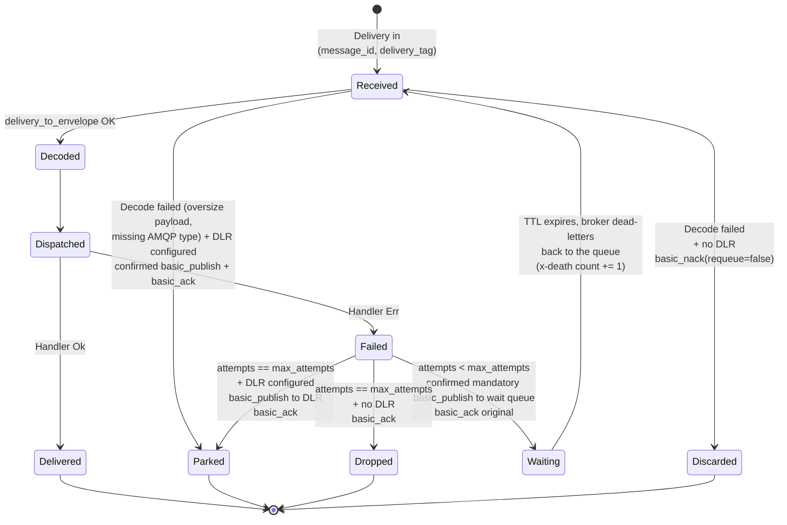
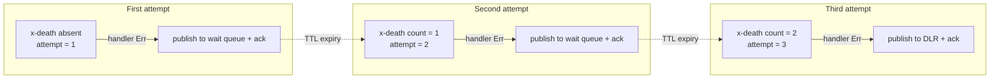

# Retry policy and dead-letter routing

In `AckMode::Manual`, the `RabbitMqWorker` retries each delivery up to `max_attempts` times before routing it to a dead-letter destination or dropping it. Retries are delayed and counted by the broker: failed deliveries sit in a durable wait queue (`<queue>.retry`) whose TTL enforces `retry_delay`, and the attempt count travels in the broker-maintained `x-death` header. This page explains the state machine, the durable accounting, and the operational caveats.

## State machine per delivery



## Durable accounting via `x-death`

Every time the broker dead-letters a message it appends or updates an entry in the `x-death` header. The wait queue is a dead-letter hop by construction (the message expires there and is routed back to the consumed queue), so the entry whose `queue` is the wait queue and whose `reason` is `expired` counts the completed retry cycles. The worker reads that count and adds one to obtain the current attempt number; nothing is stored in process memory.



Because the count travels with the message, it survives worker restarts and is shared by every consumer of the queue: a poison message restarted mid-retry resumes at its real attempt number instead of getting a fresh budget.

## Operational caveats

1. **Wait queue arguments are frozen at declare time.** The TTL is baked into the `<queue>.retry` arguments, so changing `retry_delay` for an existing wait queue makes the declaration fail with a broker precondition error. Delete the wait queue first (or keep the delay stable per queue).
2. **Duplicates are possible.** If the ack of the original fails after the retry copy reached the wait queue, the broker redelivers the original and both copies eventually run. This is inherent to at-least-once delivery; handlers must be idempotent.
3. **The delay is uniform per queue.** Every retry of every message on a given queue waits the same `retry_delay`; per-message TTLs are deliberately avoided because RabbitMQ only expires the head of a queue (head-of-line blocking).

## Dead-letter queue

Set `dead_letter_routing_key` on the builder to route exhausted deliveries to a durable dead-letter queue of that name. The worker declares the queue at startup, so the routing key always has a bound queue on the default exchange and an exhausted delivery can never be silently unroutable.

```rust
let worker = RabbitMqWorkerBuilder::new(connection)
    .queue("orders.received")
    .max_attempts(5)
    .dead_letter_routing_key("orders.parked")
    .register_handler::<OrderPlaced, _>(MyHandler)
    .build()?;
```

The dead-letter publish is hardened end to end: the worker channel runs with publisher confirms (enabled whenever a dead-letter routing key is set, regardless of ack mode, and always under `Manual`), the publish is `mandatory`, and the copy is forced to persistent delivery (`delivery_mode` 2) so it survives a broker restart. Success requires a broker ack without a returned message. Any other outcome (a nack, an unroutable return, a missing confirm) means the copy did not land, so the worker nacks the original to free its prefetch slot rather than leaving it unsettled: a transient transport failure requeues the delivery for another attempt, while an unroutable dead-letter queue drops it. Leaving the delivery unacked on a live channel would not trigger redelivery (brokers only redeliver after the channel or connection closes) and would silently consume a prefetch slot until the consumer stalled.

The same hardened publish parks poison deliveries: a payload larger than `max_payload_bytes` or a delivery missing the AMQP `type` property never reaches a handler, skips the retry budget entirely, and is routed straight to the dead-letter queue when one is configured. Without a dead-letter queue, a `Manual` consume nacks the poison delivery without requeue, so a broker-level dead-letter exchange configured on the queue still receives it.

Two operational notes:

1. **Queue arguments must match.** The worker declares the dead-letter queue as a plain durable queue. If a queue of the same name already exists with different arguments, the declaration fails with a broker precondition error at startup; align or delete the pre-existing queue.
2. **Duplicates are possible.** As with retries, if the final ack fails after the dead-letter copy was confirmed, the broker redelivers the original and a second copy can reach the dead-letter queue. Consumers of the dead-letter queue must tolerate duplicates.

When the routing key is not configured, exhausted deliveries are dropped with a `tracing::warn` log.

## Roadmap notes

- **Delayed retries and persistent counters** shipped with the wait-queue mechanism described above (`Reliability` milestone).
- **Exponential backoff tiers** (multiple wait queues with increasing TTLs) are a possible extension; today the delay is a single fixed `retry_delay` per queue.
- **Per-handler retry policies** (different `max_attempts` per message type) are tracked in the `Reliability` milestone.
