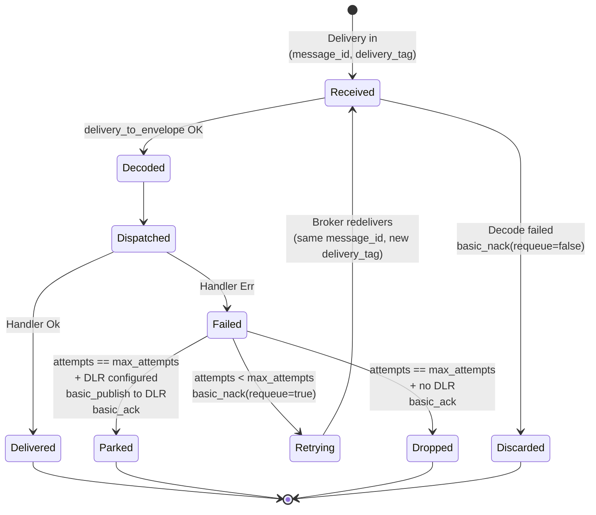
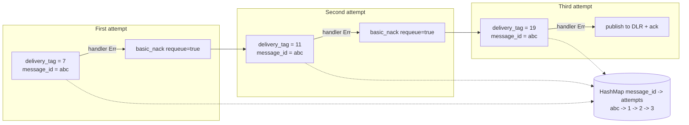

# Retry policy and dead-letter routing

In `AckMode::Manual`, the `RabbitMqWorker` retries each delivery up to `max_attempts` times before routing it to a dead-letter destination or dropping it. This page explains the state machine, the rationale behind keying the retry counter on `message_id`, and the volatility caveat across consumer restarts.

## State machine per delivery



## Why the counter is keyed on `message_id`

`basic_nack(requeue=true)` puts the same payload back on the queue but the broker assigns a fresh `delivery_tag` on the next delivery. A naive counter keyed on `delivery_tag` would therefore reset on every redelivery and the worker would retry forever.

`hexeract-bus-rabbitmq` sidesteps the problem by keying its in-memory `HashMap<Uuid, u32>` on the AMQP `message_id` property, which the publisher mints once (UUIDv7) and the broker carries verbatim through `basic_nack(requeue=true)` redeliveries.



## Volatility caveat

The counter lives in memory. If the consumer process restarts mid-retry, the counter resets to zero on the next delivery for that `message_id`. Three concrete consequences:

1. A pathological message that always fails can survive the `max_attempts` budget across restarts and keep being retried.
2. The actual number of attempts observed by an external system can exceed `max_attempts` if you restart the consumer often.
3. The exact `attempts == max_attempts` boundary is a per-process counter, not a global counter.

For workloads that need durable retry accounting, pair the worker with a broker-side dead-letter exchange (DLX) policy. RabbitMQ DLX moves a message to a target exchange after a configurable redelivery limit, and the limit is enforced by the broker rather than by the consumer.

## Dead-letter routing key

Set `dead_letter_routing_key` on the builder to route exhausted deliveries to the default exchange under a known routing key. The default exchange routes by routing key directly to the queue of the same name, so declaring a `dead_letter_routing_key = "orders.parked"` plus a queue named `orders.parked` is all you need.

```rust
let worker = RabbitMqWorkerBuilder::new(connection)
    .queue("orders.received")
    .max_attempts(5)
    .dead_letter_routing_key("orders.parked")
    .register_handler::<OrderPlaced, _>(MyHandler)
    .build()?;
```

When the routing key is not configured, exhausted deliveries are silently dropped (logged via `tracing::warn`).

## Roadmap notes

- **Exponential backoff** between retries lands in v0.5.0 (`Reliability` milestone). Today every redelivery is immediate.
- **Persistent retry counters** are out of scope for v0.2.0; the broker-side DLX is the recommended workaround.
- **Per-handler retry policies** (different `max_attempts` per message type) land in v0.5.0.
