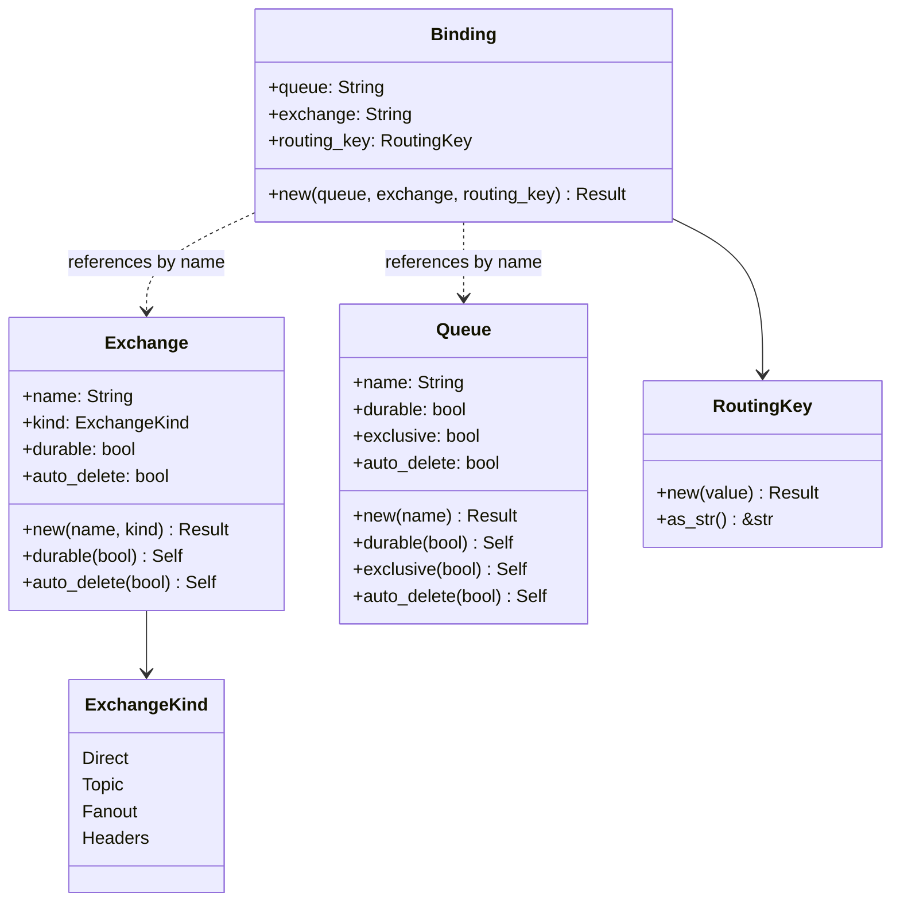

# Topology types

`hexeract-bus` ships strongly-typed declarations for the four AMQP topology primitives: `Exchange`, `Queue`, `Binding`, `RoutingKey`. Backends apply these declarations to a running broker; the CLI loads them from a TOML file.

## The four types



## Validation rules

Every constructor validates the inputs before returning the typed value. The rules match the AMQP 0.9.1 limits.

| Field | Rules |
| --- | --- |
| Exchange / queue / binding endpoint names | non-empty, at most `MAX_NAME_LEN` (127) bytes, no ASCII control characters |
| Routing keys | at most `MAX_ROUTING_KEY_LEN` (255) bytes, no ASCII control characters; empty is **allowed** because fanout exchanges ignore the routing key |

A validation failure surfaces as [`BusError::InvalidTopology { reason }`](../reference/hexeract-bus.md). Both the typed constructors and `serde` deserialisation (`RoutingKey` uses `#[serde(try_from = "String")]`) go through the same validator, so a malformed value in a TOML file fails before the broker ever sees it.

## Defaults

| Type | Defaults applied by `new` |
| --- | --- |
| `Exchange` | `durable = true`, `auto_delete = false` |
| `Queue` | `durable = true`, `exclusive = false`, `auto_delete = false` |

The fluent setters (`exchange.durable(false)`, `queue.exclusive(true)`, etc.) override the defaults without re-validating.

## TOML schema (CLI)

The `hexeract bus declare --topology FILE` subcommand consumes this shape:

```toml
[[exchanges]]
name = "orders.exchange"
kind = "topic"
durable = true
auto_delete = false

[[queues]]
name = "orders.received"
durable = true
exclusive = false
auto_delete = false

[[bindings]]
queue = "orders.received"
exchange = "orders.exchange"
routing_key = "orders.*"
```

Booleans default to `true` for `durable` and `false` for the others, matching the library defaults. Each entry is re-validated through the typed constructors, so an invalid name still fails before reaching the broker.

## Where the topology lives at runtime

`hexeract-bus-rabbitmq` exposes four convenience helpers that translate `Exchange` / `Queue` / `Binding` values into AMQP commands:

- `declare_exchange(connection, &exchange)` opens a short-lived channel, calls `exchange.declare`, drops the channel.
- `declare_queue(connection, &queue)` likewise for `queue.declare`.
- `bind_queue(connection, &binding)` likewise for `queue.bind`.
- `ensure_topology(connection, exchanges, queues, bindings)` applies the three phases on a single channel, in dependency order.

These helpers are documented as POC / dev-convenience. For production, declare the topology once at service startup (or out of band via the CLI) rather than calling these on the publish hot path.
