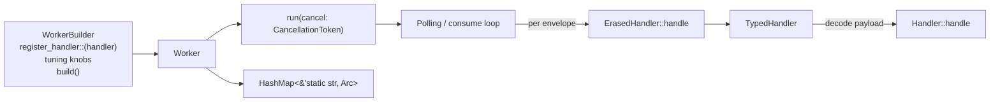

# Worker lifecycle

Hexeract ships two workers in v0.2.0: [`OutboxWorker`](../reference/hexeract-outbox.md) for the database-backed outbox and [`RabbitMqWorker`](../reference/hexeract-bus-rabbitmq.md) for the AMQP bus. They are intentionally symmetric: same fluent builder shape, same `run(cancel)` entry point, same handler dispatch via `ErasedHandler`.

## Generic shape



## Spawn pattern

```rust
let cancel = CancellationToken::new();
let join = tokio::spawn(worker.run(cancel.clone()));

// ... business code emits events / messages ...

cancel.cancel();
join.await??;
```

Both workers honour the `CancellationToken`: `OutboxWorker` checks between poll cycles, `RabbitMqWorker` selects on `consumer.next()` and the cancel signal. A cancelled worker drains the in-flight envelope (if any) and returns `Ok(())`.

## Outbox-specific timing

`OutboxWorker` is a poll loop. Two knobs drive its rhythm:

- `poll_interval` (default `100 ms`): sleep duration when a poll returned no rows.
- `batch_size` (default `10`): maximum rows fetched per poll.

A non-empty poll runs back-to-back without sleeping, so a backlog drains as fast as the handler can process. An empty poll sleeps `poll_interval` and tries again.

## Bus-specific timing

`RabbitMqWorker` is push-based: it calls `basic_consume` and reacts to deliveries the broker pushes. Three knobs:

- `prefetch` (default `16`): how many unacknowledged deliveries the broker may have in flight at once.
- `max_attempts` (default `5`): retry budget per `message_id` before the delivery is parked or dropped (see [retry policy](retry-policy.md)).
- `max_payload_bytes` (default `1 MiB`): cap on the size of a consumed payload, enforced before the payload is copied or deserialized. Broker bytes cross a trust boundary, so an oversize delivery follows the poison path: parked in the dead-letter queue when one is configured, dropped with a warning otherwise (see [retry policy](retry-policy.md)). The broker has already buffered the frame when the worker sees it, so the cap bounds the consumer's work, not the network: pair it with the broker-side `max_message_size` to bound ingress. Worst-case consumer buffering is roughly `prefetch x max_payload_bytes`.

## ErasedHandler and TypedHandler

The worker keeps handlers in a `HashMap<&'static str, Arc<dyn ErasedHandler>>` keyed by `MESSAGE_TYPE` / `EVENT_TYPE`. The user-facing trait is the typed `Handler<M>`; `TypedHandler<M, H>` is the adapter that translates from the dyn-safe `ErasedHandler::handle(&envelope, &ctx) -> BoxFuture<Result<(), BusError>>` to the typed `H::handle(message, &ctx) -> Result<(), H::Error>`.

The decoding step (`envelope.decode::<M>()`) lives in `TypedHandler`, so the worker's dispatch loop never needs to know the concrete message type. If the inbound envelope carries a `message_type` no handler registered for, the dispatch returns `BusError::MissingHandler { message_type }`, which the worker logs and (in `AckMode::Manual`) treats as a handler failure subject to the retry policy.

## Idempotency expectations

| Worker | Delivery semantics | Idempotency requirement |
| --- | --- | --- |
| `OutboxWorker` | At-least-once; a crashed worker releases its `SELECT ... FOR UPDATE` lock and another worker picks the envelope up. | Required. Same `event_id` may invoke the handler more than once. |
| `RabbitMqWorker` | At-least-once; redeliveries on failure, and broker reconnects can replay messages. | Required. Same `message_id` may invoke the handler more than once. |

Idempotency is not optional. The recommended pattern is to write the side effect plus a `processed_message_id` row in the same database transaction, then short-circuit on the second delivery when the `processed_message_id` is already present.

## Graceful shutdown

Both workers honour cooperative cancellation:

1. Caller flips the `CancellationToken`.
2. `OutboxWorker` finishes the current poll cycle (commits the transaction or rolls back) and exits the loop.
3. `RabbitMqWorker` lets the in-flight delivery resolve through the handler, sends the ack or nack, then exits the consume loop.
4. `run` returns `Ok(())` and the `JoinHandle` resolves.

A worker that crashes (panic or unwrap) bubbles the panic to the `JoinHandle`. Wrap your handler logic in `Result::Err` mapping rather than panicking.

## Connection loss and supervised recovery

`RabbitMqWorker` never reconnects on its own. The contract of `run` makes the two exit paths unambiguous:

- `Ok(())` is returned for a cooperative cancellation, and nothing else.
- `BusError::Connection` is returned when the consumer stream ends while the token has not fired: the connection or channel is gone and the worker cannot recover it.

Recovery belongs to the caller, because a supervisor that rebuilds everything from scratch has no partial state to reconcile. Each iteration of the loop below reconnects with backoff, re-applies the application topology, and re-creates the worker, which re-declares the wait and dead-letter queues, re-enables publisher confirms and re-subscribes the consumer:

```rust
loop {
    let connection =
        RabbitMqConnection::connect_with_retry(&uri, 5, Duration::from_millis(500)).await?;
    ensure_topology(&connection, &exchanges, &queues, &bindings).await?;
    let worker = RabbitMqWorkerBuilder::new(connection)
        .queue("orders.received")
        .dead_letter_routing_key("orders.parked")
        .register_handler::<OrderPlaced, _>(MyHandler)
        .build()?;
    match worker.run(cancel.clone()).await {
        Ok(()) => break,
        Err(err) => {
            tracing::error!(error = %err, "bus worker stopped, restarting");
            tokio::time::sleep(Duration::from_secs(1)).await;
        }
    }
}
```

Redeliveries across reconnects are covered by the at-least-once semantics above: unacked deliveries return to the queue when the connection drops and the retry budget keeps travelling in the `x-death` header, so a restarted worker resumes the count instead of starting over.

On the publish side, `RabbitMqTransport` fails fast rather than recovering: the channel pool discards cached channels whose connection has dropped and surfaces `BusError::Connection` when a fresh channel cannot be opened. Wrap publishes with the retry or outbox layer when the application needs them to survive a broker outage.
