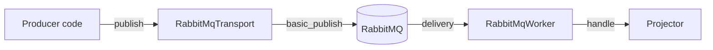

# Bus quick start (RabbitMQ)

This page walks you through publishing and consuming a typed message on a RabbitMQ broker in roughly five minutes. By the end you will have a producer side calling `RabbitMqTransport::publish` and a consumer side running a `RabbitMqWorker` with a typed `Handler<M>`.

## Prerequisites

- Rust 1.88 or later (`rustup toolchain install 1.88.0`).
- A RabbitMQ broker reachable from your machine. For local development, the easiest is `docker run -d --rm --name rabbit -p 5672:5672 rabbitmq:3-management`.

## Step 1: add the dependencies

```toml
[dependencies]
hexeract-bus = "0.2"
hexeract-bus-rabbitmq = "0.2"
hexeract-core = "0.1"
serde = { version = "1", features = ["derive"] }
tokio = { version = "1", features = ["macros", "rt-multi-thread"] }
tokio-util = "0.7"
uuid = { version = "1", features = ["v7"] }
```

## Step 2: declare the message type

```rust
use hexeract_bus::Message;
use serde::{Deserialize, Serialize};
use uuid::Uuid;

#[derive(Debug, Serialize, Deserialize)]
struct OrderPlaced {
    order_id: Uuid,
}

impl Message for OrderPlaced {
    const MESSAGE_TYPE: &'static str = "orders.placed";
}
```

The `MESSAGE_TYPE` is the stable routing key consumers dispatch on. Pick a kebab-cased identifier scoped by bounded context.

## Step 3: declare the topology (optional but recommended)

For the simplest case, publish to the AMQP default exchange (empty string) and consume from a queue named after the routing key. The default exchange routes by routing key directly to the queue of the same name.

If you need a topic exchange with bindings, declare the topology once at startup through the `topology` helpers (or out of band via `hexeract bus declare`):

```rust
use hexeract_bus::{Binding, Exchange, ExchangeKind, Queue, RoutingKey};
use hexeract_bus_rabbitmq::{RabbitMqConnection, ensure_topology};

let conn = RabbitMqConnection::connect("amqp://localhost:5672").await?;
let exchange = Exchange::new("orders.exchange", ExchangeKind::Topic)?;
let queue = Queue::new("orders.received")?;
let routing_key = RoutingKey::new("orders.*")?;
let binding = Binding::new(&queue.name, &exchange.name, routing_key)?;

ensure_topology(&conn, &[exchange], &[queue], &[binding]).await?;
```

## Step 4: write a handler

```rust
use hexeract_bus::{BusError, Handler};
use hexeract_core::HandlerContext;

struct Projector;

impl Handler<OrderPlaced> for Projector {
    type Error = BusError;

    async fn handle(
        &self,
        message: OrderPlaced,
        ctx: &HandlerContext,
    ) -> Result<(), Self::Error> {
        tracing::info!(
            order_id = %message.order_id,
            correlation_id = ?ctx.correlation_id,
            "consumed order"
        );
        Ok(())
    }
}
```

Handlers must be idempotent: the broker may redeliver the same `message_id` after a transient failure (see the [retry policy](../concepts/retry-policy.md)).

## Step 5: spawn the worker

```rust
use hexeract_bus_rabbitmq::{RabbitMqConnection, RabbitMqWorkerBuilder};
use tokio_util::sync::CancellationToken;

let consumer_conn = RabbitMqConnection::connect("amqp://localhost:5672").await?;
let worker = RabbitMqWorkerBuilder::new(consumer_conn)
    .queue("orders.received")
    .max_attempts(5)
    .register_handler::<OrderPlaced, _>(Projector)
    .build()?;

let cancel = CancellationToken::new();
let join = tokio::spawn(worker.run(cancel.clone()));
```

The worker calls `basic_consume`, prefetches up to 16 deliveries by default, and dispatches each to your handler.

## Step 6: publish

```rust
use hexeract_bus::Transport;
use hexeract_bus_rabbitmq::RabbitMqTransport;

let transport = RabbitMqTransport::new("amqp://localhost:5672").await?;
let order = OrderPlaced { order_id: Uuid::new_v4() };

let message_id = transport.publish("orders.received", &order).await?;
println!("published message {message_id}");
```

To continue a causal chain across services, use `publish_with_correlation_id` and pass the inbound `ctx.correlation_id`. See the [correlation ID concept](../concepts/correlation-id.md).

## Step 7: shutdown

```rust
cancel.cancel();
join.await??;
```

The worker drains the in-flight delivery, sends the final ack or nack, and exits cleanly.

## What you just wired up



## Next steps

- Read the [bus flow architecture](../architecture/bus-flow.md) for the full lifecycle from publish to ack.
- Read the [ack modes](../concepts/ack-modes.md) and [retry policy](../concepts/retry-policy.md) to tune the consumer for your reliability targets.
- Run the end-to-end example: `cargo run --example 03_bus_pubsub -p hexeract-examples` (Docker required).
- Provision topology out of band with [`hexeract bus declare`](../reference/cli.md).
